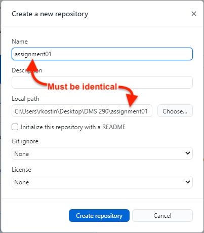
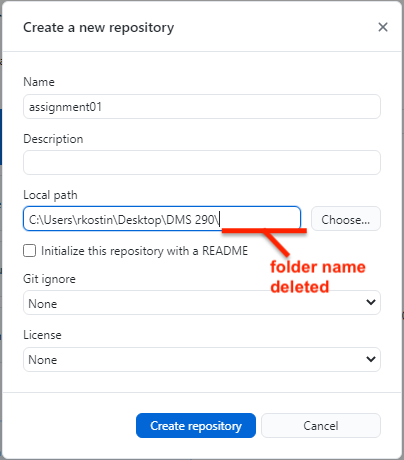

# Assignment 2: GitHub

*Due: Friday, February 19, 2021*

The goal of this assignment is to practice using some of the features of GitHub: forking, and syncing.  

**If you did the extra credit from Assignment 1, [skip to Part 2](https://docs.csc174.org/assign02-github/instructions#part-2-share-your-repo-and-get-a-repo)**

## Part 1: Make a Repo for Assignment 1

1. Go to [github.com](https://github.com) and create an account if not already
2. Download and install the [GitHub Desktop Software](https://desktop.github.com/) if not already
   - Note: Mac users, you may have to move the **GitHub Desktop.app** file to your Applications folder manually

*Note: the next steps show you <u>one way</u> how to turn your Assignment 1 files on your computer into a sync'd GitHub repository.  Just be aware that there are other ways to do this.*

3. IMPORTANT: GitHub needs the folder that you're going to turn into a repository to be named with n*o spaces* and *no special characters*!  If you need to change the name of your Assignment 1 folder, do it now
   - E.g. if it was **Assignment 1** change it to something like **assignment01**

4. In the GitHub Desktop software (assuming you've never used it before), after you've started it for the first time and connected it with your GitHub account successfully: select **Create a New Repository on your hard drive**

5. In the dialog box that appears, set the "Local Path" to point to your existing DMS 290 Assignment 1 folder

*Careful here...*

6. Up in the top of the dialog box where it says *Name*, carefully type (or copy & paste) the name of the folder only like this...

Warning: if you get a warning that the *Name* was changed to anything else, then do not proceed!  Cancel-out, fix the name of the actual folder and try again.  

*Careful here too...*

7. Still in the dialog box, in the *Local Path*, DELETE the name of the folder and leave just the path leading *up to* the existing folder, like this...

8. Click **Create Repository**

9. Back in the main window of the GitHub Desktop software, click the **Publish repository** button

10. In the dialog box that appears, UNcheck the checkbox **Keep this code private** (our repos in DMS 290 must be "public")

11. Click the **Publish Repository** button

*Check your handiwork*

12. Go to Github.com in a web browser and navigate to "Your repositories" from the profile menu (the icon) in the top-right

13. There, you should see a link to your Assignment 1 repository; click it and look around; if you did the steps above correctly, you should see your files listed in github.com - if not, try again

The URL in your web browser (e.g. **github.com/rkostin/assignment01**) is the URL you can share with the class.

## Part 2: Share your Repo and Get a Repo

1. Go to our shared file: [DMS 290 Assignment 2: GitHub (Google Sheet)](https://docs.google.com/spreadsheets/d/1rAZzYDRKwMR2A0Kp43eG-GwvD_hC88srLtbNwXHsvtM/edit#gid=0)
2. If you haven't already, paste your Assignment 1 repository URL (from Part 1, above) into **Column C: GitHub Repository**

*Note: your link to your Assignment 1 website in UR Digital Scholar should already be in Column B.  If not, get that and paste that there.*

3. Review the other students' Assignment 1 websites
4. Any Assignment 1 website that has *not* been claimed already, indicated by a RED background is up for grabs; choose one that you want to work on in Assignment 2
5. When you've made a choice, copy the website and repo URLs from columns B and C and paste them by your name in columns F and G
6. Re-color the background of the URLs you copied in columns B and C to RED to indicate that that website has been selected so no one else uses it

## Part 3: Fork Your Chosen Website's Repository

1. Using the link you copied into column G, go to the GitHub repo for the website you selected
2. In GitHub.com, in that repository, click the **Fork** button in the top-right and *fork* the repo to your GitHub account; when the procedure finishes, you'll be looking at a *copy* of the other student's repo in *your* account
3. Click the green Code button and select **Open with GitHub Desktop**
4. After you let the GitHub Desktop software start, you'll be looking at the **Clone a Repository** dialog box where you'll need to Choose the local path - where you want to copy the repo to on your own computer
5. In the *Local Path* you can change the name of the folder (the last part in the path) to whatever you want - something meaningful for you like **assignment02**
6. Click the **Clone** button

*If you're asked How are you planning to use this fork? ...say, "For my own purposes"* and then click *Continue*

Go checkout your handiwork.  Look at the Assignment 2 folder that was created on your computer.

## Part 4: Make Improvements

This next part isn't really defined well on purpose.  The point of DMS 290 is to learn the principles of design and then apply them to web pages - which we haven't done yet.  So the "improvements" you need to do at this point only need to meet these requirements:

- **Layout:** change something about the way some or all the **content is positioned/structured** visually on the website in a way that makes it subjectively better in your opinion
- **Embellishments:** alter the website's **color pallet**, **fonts** (typeface, size, and/or weight), or any other **visual embellishments** (margins, padding, and borders) to subjectively make the website look better in your opinion.  

...and be sure to take notes about the changes you make because you need to report them as part of the next step.

Also, note: as you make changes to your website, you should toggle over to the GitHub Desktop software after each task you complete, and make a "commit" for each one.  Be sure you write meaningful comments.  And then from time to time, *Push* your commits to github.com.    d

### Create a readme.md file

The ".md" in the readme filename stands for "markdown."  Writing markdown is a simple kind of formatting that we'll talk about later in the semester, but for now, just see [this table in the Markdown Wikipedia page](https://en.wikipedia.org/wiki/Markdown#Example) and then try some simple *pseudo formatting* of your text as you create headings, paragraphs, lists, etc. in your readme.md file.

- In your assignment02 folder, create a text file named **readme.md** if it doesn't exist already.
- Edit the readme file and in your own words, describe the layout and embellishment changes you made to the website.  You do not have to be verbose.  Just list the changes AND describe why you think they're better.  And don't say something like, "I think they look better."  Try to explain your rationale in terms of legibility, readability, and usability*

\* Those terms (legibility, readability, and usability) are exactly what we'll be studying this semester.  But for now, just Google those terms and briefly understand their meaning. Then try to relate what you did to the website in those terms.

## Part 4: Submit the Assignment

To get credit for your work:

- Install the website on your UR Digital Scholar account in a folder named **assignment02**

- Submit a link to the **website** AND a link to the **repository** in Blackboard, in the assignment: **Assignment 2: GitHub**

*The breakdown of points and extra credit for this assignment can be seen in the rubric in Blackboard*