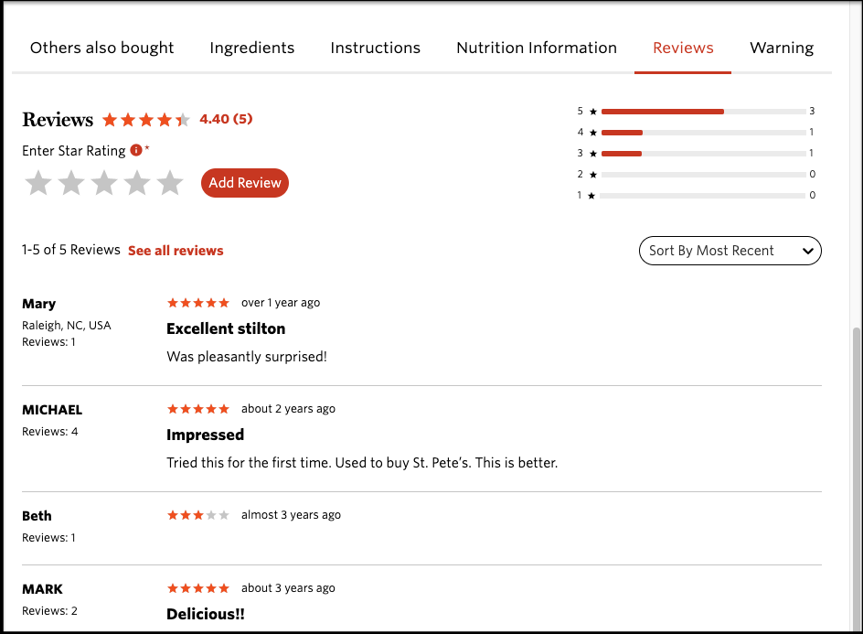
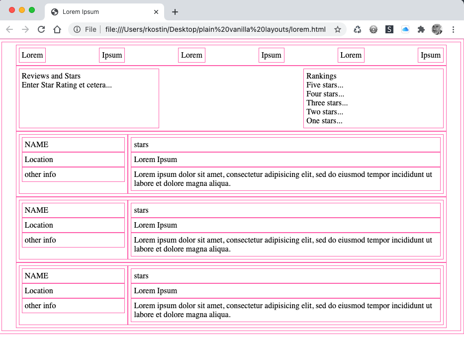

# Assignment 6: Layout Principles

*Due: Friday, March 19, 2021*

NOTE: this is another *individual assignment* - you will work on this assignment by yourself and turn it in on Blackboard for your own grade.

**The goal** of this assignment is to demonstrate your understanding of the page layout principles, specifically: F-Layout, Z-Layout, and Card Layout.  (There are other page layouts but these are the ones we'll focus on today.)

**The purpose** of this assignment is to find good examples of page layout that works well that you can implement later in Project 2

## Step 1: Find Examples

- Search the web for examples of webpage layouts that demonstrate good use of **the Gutenberg Rule** and **reading gravity**:
  - An example of **F-Layout**
  - An example of **Z-Layout**
- Also search the web for an example of a **Card Layout** 

## Step 2: Explain the Examples

- Create an markdown file named **assignment06.md**
  - Just like with the previous assignments you need to format the markdown document using typical college-level elements for any assignment you need to turn-in for a grade
- In the markdown document, describe each example
  - State the type of example (F- Z- or Card)
  - Provide a link to the example webpage
  - Describe, in your own words, how it works - using the technical terms from the lecture video on Friday, March 12
    - The F- and Z-layout examples must be described in terms of the Gutenberg Rule
    - The Card Layout does not follow the Gutenberg Rule, but is still useful for other reasons.  Explain.

## Step 3: Create a Wireframe

- Pick **one** of the three webpage examples you found and replicate its layout using a simple HTML and CSS wireframe mockup of it
  - HTML: Keep it simple; use placeholder content only
  - CSS: use minimal styles so we can focus on the layout only

#### Hints & Tips

- HTML: when creating a wireframe, from a technical standard, the bar is *very* low.  You can use lots of DIVs (because there's no real content) and hack-up the HTML as much as you need to do; the goal is to focus on the visual layout, not the content
- CSS: the difficult part of this step is writing the CSS.  You should use **CSS Flex** and/or CSS Grid to create the layout.  If you need help with that, use the #help channel in Slack.  (The professor is pretty good at this stuff - just ask and he'll tell you the answers!)

*Here's an example of an F-Pattern Webpage (from the Wegmans website):*

*And here's an example of a wireframe mock-up of the same page. Notice in this example, the important part is to show the "F-ness" of the layout. If you were doing a Z-pattern layout or a Card-layout, that should be clearly visible in the page...*



Notice that you only have to *approximate* some content - just so we have something to look at.  The important part of this exercise is to show the *bare bones* layout.  Use of the *hotpink* borders is an industry standard for this kind of work.  

Suggestion: add this to the top of your CSS to help visualize the box model...

```css
* { 
	box-sizing: border-box;
	border: 1px solid hotpink; 
	padding: 5px;
}
body { margin: 0; }
```


## Step 4: Turn-in the Markdown Document and Wireframe

To get credit for your work:

- Compress your **assignment06.md** markdown document and **wireframe files** into a ZIP file

- In Blackboard, upload the ZIP file into the **Assignment 6: Layout Principles** assignment